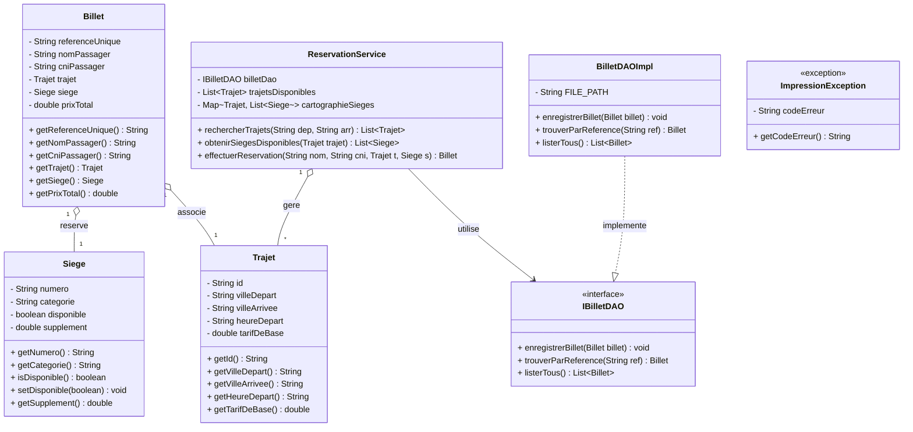
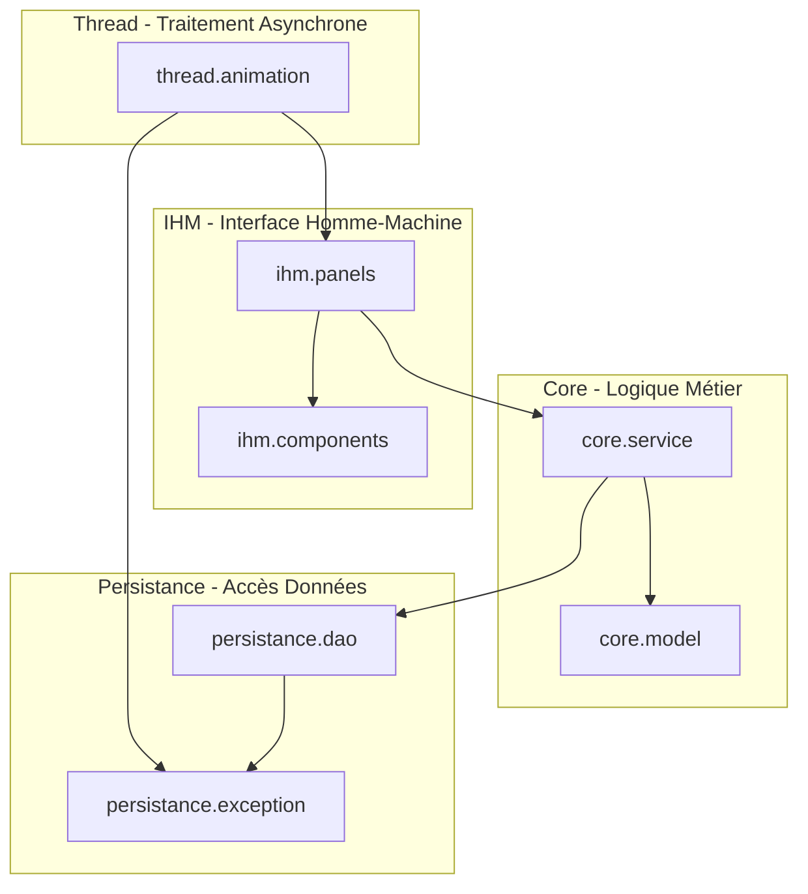

# Guide d'Architecture Technique et README

## Projet 6 : Système de Vente et d'Impression de Billets (Camrail Intercity) - Examen ICT308

---

### Objectif du Document
Structurer le travail pour l'équipe de 10 personnes afin d'éviter les conflits de code, définir précisément le rôle de chaque sous-groupe et garantir une architecture logicielle propre et modulaire (MVC) respectant scrupuleusement le cahier des charges.

---

## 1. Architecture Générale du Projet (Modèle-Vue-Contrôleur)

Afin de s'assurer que les développements des 10 membres s'assemblent sans friction, le projet adoptera une architecture standardisée découpée en packages stricts. Aucun code de l'IHM ne doit manipuler directement les fichiers, et aucune classe métier ne doit instancier de composant Swing.

```text
src/
└── com/
    └── camrail/
        ├── Main.java                        # Point d'entrée de l'application
        ├── core/                            # Équipe 1 : Métier & Logique
        │   ├── model/                       # Classes de données (Trajet, Siege, Billet)
        │   └── service/                     # Algorithmes de gestion et de validation
        ├── persistance/                     # Équipe 2 : Fichiers & Exception
        │   ├── dao/                         # Interface et implémentation d'écriture
        │   └── exception/                   # Exceptions matérielles simulées
        ├── ihm/                             # Équipe 3 : Interface Swing
        │   ├── components/                  # Éléments réutilisables (Boutons, Tables)
        │   └── panels/                      # Assistant Écran 1, 2, 3 géré par CardLayout
        └── thread/                          # Équipe 4 : Multithreading & Async
            └── animation/                   # SwingWorker, Simulateur d'Impression
```

---

## 2. Modélisation UML & Contrats d'Interface

Pour travailler sereinement en équipe, nous avons besoin de la modélisation UML du travail pour avoir une vue plus claire de ce qu'il y aura lieu de faire. Sinon chacun travaillera avec ce qu'il aura créé de son côté et ce ne sera pas évident.

Voici donc le diagramme de classes et le diagramme de composants à respecter obligatoirement sur toutes les branches.

### Diagramme de Classes UML (Mermaid)



### Diagramme de Composants (Architecture de Flux)


